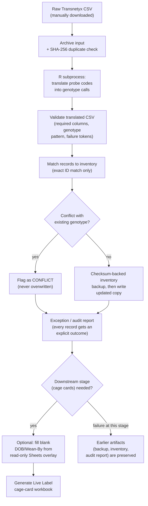
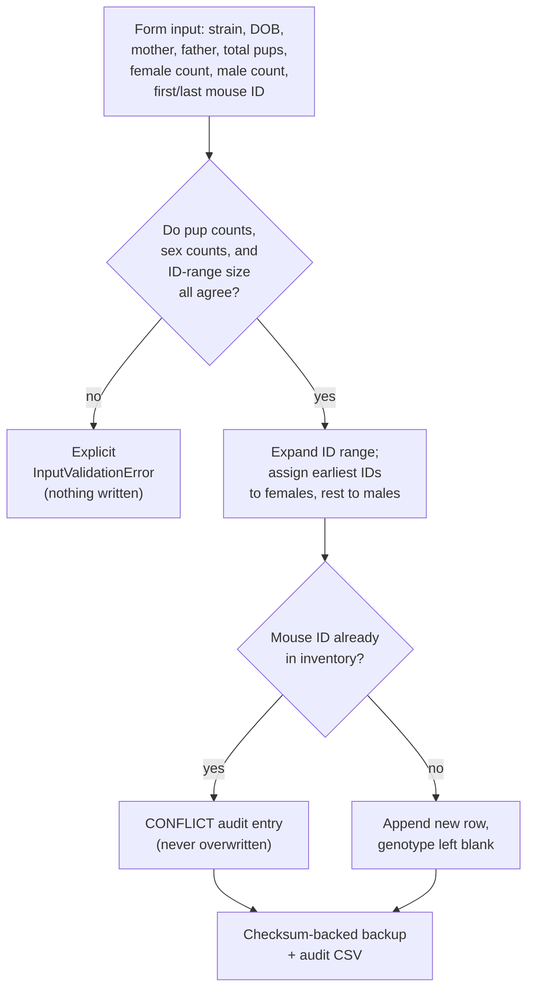
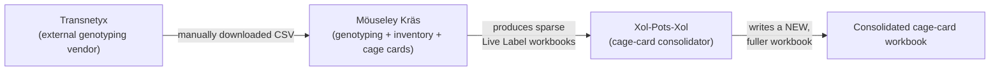
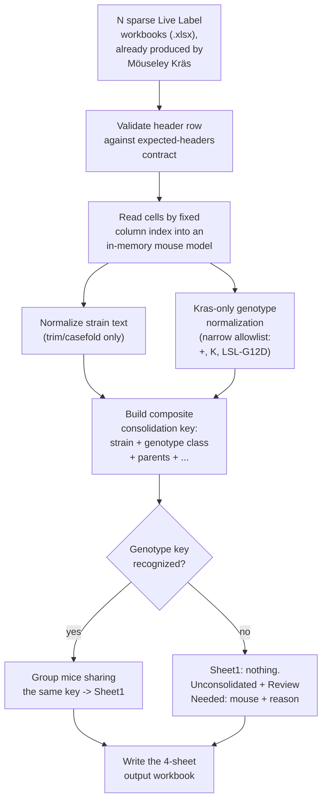

# Möuseley Kräs & Xol-Pots-Xol — Project Status and Detailed Overview

**Packaged:** 2026-08-28. This is a single, self-contained snapshot combining three things that
were previously scattered across separate documents: the current work-in-progress status, the
latest system debriefing and code artifacts, and a detailed technical overview of both projects.
It follows the standing two-domain convention (System Debriefing / Isolated Code Artifacts) for
the status portion, and reuses the durable architectural material from
`mouseley-kras-and-xol-pots-xol-overview.md` for the technical portion, updated where that
material had gone stale.

---

## Part 1 — Work in Progress

Both tools are functionally complete for their original single-Mac use case. The active thread of
work is a **portability initiative**: making both tools installable and runnable by other lab
members, on other operating systems, without changing what either tool does.

| Phase | Content | Status |
|---|---|---|
| 1 | Git initialized; portability scoped as a real goal | Done, committed |
| 2 | Per-project virtual environments, locked dependencies, verified across Python 3.11–3.14 | Done, committed |
| 3 | Windows (`.ps1`) and Linux (`.sh`) launchers, cross-platform R-executable discovery | Implemented, committed; Linux proxy-tested via bash on macOS; Windows implemented but never executed |
| 3, fix round | Repaired a recurring macOS editable-install bug for good (regression test added); fixed a PowerShell argument-parsing bug (inspected, not executed); responded to two full codex review cycles and one copilot review | Done, committed |
| 4 | Verification on real Windows/Linux machines or CI | **Not started** |

**Open items still awaiting a decision or event outside this session's reach:**
- The external R translation script (`Transnetyx_genotyping.R`) has a SHA-256 checksum recorded
  automatically per run, but no human-readable version or Git identity of its own. Whether to give
  it one is an open call for the user.
- Phase 4 needs either a real Windows machine, a real Linux machine, or a CI job with both — none
  of which exist in this session's environment. Codex's and copilot's reviews left a concrete test
  plan for each platform (see Part 2, Isolated Code Artifacts).

---

## Part 2 — Latest System Debriefing & Isolated Code Artifacts

### System Debriefing

The most recent work was a fix-and-review cycle triggered by two rounds of independent peer
review (codex twice, copilot twice) of the Phase 3 portability deliverable. Both reviewers
re-executed the actual repair-and-test cycle themselves rather than trusting the written report,
and that was the right call: a macOS-specific bug that had been "fixed" in an earlier phase had
quietly recurred, and their review caught it before it was reported as resolved.

What was found and done, in order:
1. **Reproduced a real regression.** The hidden-`.pth` editable-install bug (a macOS `UF_HIDDEN`
   flag on `.venv` files causing Python 3.14's `site.py` to silently skip the file that registers
   an editable install) had recurred. `automouse --help` and `xolpotsxol --help` both failed with
   `ModuleNotFoundError` on inspection.
2. **Found the actual proximate cause of that specific recurrence**: the existing repair script,
   `scripts/fix_hidden_venv.sh`, has a `#!/bin/zsh` shebang using zsh-only path expansion
   (`${0:A:h:h}`); invoking it with `bash` instead of `zsh` (or running it directly as
   `./scripts/fix_hidden_venv.sh`) fails immediately and does nothing. Running it correctly fixed
   both projects at once.
3. **Closed the gap for good, not just for today.** Added a permanent regression test to each
   project (`tests/test_editable_install_health.py`, `xol-pots-xol/tests/test_editable_install_health.py`)
   that fails loudly if any editable-install `.pth` file is hidden on macOS, so this can't again
   surface later as a confusing runtime error.
4. **Fixed a real, independently-confirmed PowerShell bug.** Both Windows setup scripts
   (`AutoMouse_Setup.ps1`, `XolPotsXol_Setup.ps1`) mishandled a bare `py` or `python` candidate (no
   version suffix) when slicing its argument array, producing a malformed range. Fixed with an
   explicit length guard. This fix is inspected and reasoned through, but — consistent with the
   whole of Phase 3 — still not executed under a real PowerShell interpreter, because none has been
   available in this environment at any point.
5. **Corrected two documentation inaccuracies** a reviewer caught: a wrong `.venv` path in the
   Phase 2 file list, and a "working tree is clean" claim that was true at commit `1fdd68d` but
   stale by the time it was read (the deliverable itself, and its companions, are new untracked
   files).
6. **Re-verified everything, twice**, including once where the hidden-flag bug recurred live
   *during* the final pre-commit check — a real-time demonstration of exactly why the new
   regression test earns its place. Repaired and reconfirmed clean before committing.
7. **Committed** the whole cycle — fixes, two new regression tests, and every review/response
   document generated along the way — as one commit, with Windows and real Linux still explicitly
   marked unverified in the commit message itself.
8. Separately, the user's global `git config` identity was corrected (email had been set
   correctly; the name had been left as the literal placeholder text `Your Name` from an example
   command, now corrected to `Ruoxi Wang`). This only affects commits made from now on — it does
   not rewrite the author on any commit already made.

### Isolated Code Artifacts

**Current git state:**
```
$ git log --oneline
012d454 Repair and re-verify macOS editable installs; fix Windows arg-parsing guard
1fdd68d Phase 3: cross-platform launchers implemented, NOT yet verified (Windows/Linux)
3824991 Correct progress docs to reflect Phase 2 is now committed
5864ec6 Phase 2 of portability initiative: separate venvs, dependency locks, fixed editable installs
bb5b398 Initial commit: Möuseley Kräs and Xol-Pots-Xol source, tests, and docs

$ git status --short
(clean)

$ git config --global user.name
Ruoxi Wang
$ git config --global user.email
ruowang@salk.edu
```

**Files touched in the most recent commit (`012d454`):**
```
Modified:
  launchers/windows/AutoMouse_Setup.ps1     (guard $parts.Length before array-slicing)
  launchers/windows/XolPotsXol_Setup.ps1    (same fix)

New:
  tests/test_editable_install_health.py
  xol-pots-xol/tests/test_editable_install_health.py
  Markdown_files/CODEX_ARCHITECTURE_REFERENCE_AUDIT.md
  Markdown_files/CODEX_DELIVERABLE_portability_phases_1-3.md
  Markdown_files/COPILOT_PROJECT_OVERVIEW.md
  Markdown_files/REVIEW_RESPONSE_codex_copilot_phase3_fixes_2026-08-28.md
  Markdown_files/REVIEW_RESPONSE_codex_confirmation_2026-08-28.md
  Markdown_files/REVIEW_codex_deliverable_portability_phases_1-3_again.md
  Markdown_files/REVIEW_codex_phase3_fixes_response.md
  Markdown_files/REVIEW_codex_confirmation_feedback_2026-08-28.md
  Markdown_files/REVIEW_copilot_phase3_readiness_suggestions.md
```

**Repair command (must be zsh, not bash — this is the actual gotcha that caused the recurrence):**
```
zsh scripts/fix_hidden_venv.sh
```

**Verification, via each project's own venv directly (the same path the launchers use):**
```
$ ./.venv/bin/automouse --help
usage: automouse [-h] [--config CONFIG] {validate-input,translate,run,enter-litter,serve} ...

$ ./.venv/bin/python -m unittest discover -s tests -q
Ran 89 tests in 0.670s
OK

$ ./xol-pots-xol/.venv/bin/xolpotsxol --help
usage: xolpotsxol [-h] --output OUTPUT [...] cage_card_files [cage_card_files ...]

$ ./xol-pots-xol/.venv/bin/python -m unittest discover -s xol-pots-xol/tests -q
Ran 35 tests in 0.079s
OK
```

**Phase 4 test plan (carried forward from codex's and copilot's reviews, not yet executed):**
```
Windows:
  - only `py` available
  - only `python` available
  - versioned `py -3.11` or newer available
  - Python below 3.11 present
  - virtual-environment creation failure
  - Rscript available only via the standard Windows install path
  - setup rerun after a partial failure

Linux:
  - both setup scripts on a real Linux distribution or CI runner (not bash-on-macOS)
  - interactive and command-line input paths in AutoMouse_Run.sh
  - both web launchers answering a real local HTTP request
  - Rscript discovery and R package checks
  - lock-file installation and editable installation
```

---

## Part 3 — Detailed Technical Overview: Möuseley Kräs

### Purpose

Möuseley Kräs (`automouse`) turns manually downloaded Transnetyx genotyping-result CSVs into three
things:
1. A reconciled copy of the mouse inventory (a master spreadsheet tracking every mouse in the
   colony).
2. An audit/exception report explaining exactly what happened to every record it touched.
3. A "Live Label" weaning-card workbook (physical cage-card labels used in the vivarium).

It also has a second, independent feature for registering brand-new litters into the inventory
before they've been genotyped at all. The name-brand feature of the system is *safety*: it is
explicitly designed to be trustworthy with irreplaceable, real laboratory records, even though it
runs as an ordinary local script/web app with no database, no server infrastructure, and no
dedicated ops team behind it.

### Core CS ideas underpinning the design

1. **Functional core, imperative shell.** Business logic that decides *what should happen* (does a
   litter's pup/sex/ID-range math add up? does a genotype match an approved pattern? which
   cage-mates can share a card?) is pure functions with no I/O; orchestration (reading files,
   calling R, writing CSVs) is a thin shell around it. This makes the hard logic unit-testable
   without touching a real file, and keeps I/O boundaries narrow and auditable.
2. **Configuration as data, not code.** Which spreadsheet column holds which field, what counts as
   an "approved" genotype string, which cells on the Live Label template map to which output
   field — all declarative data in `config/pipeline_run.yaml`, not hard-coded logic. The lab can
   re-point the tool at a differently-shaped spreadsheet without touching source code.
3. **Fuzzy-tolerant *parsing*, zero-tolerance *matching*.** Möuseley Kräs is lenient about finding
   the right column (normalizing punctuation/case to resolve a header name) but strict about
   matching a mouse to a record (exact key match only, never fuzzy, never auto-created rows).
   Cosmetic uncertainty is absorbed silently; substantive uncertainty about mouse identity is never
   guessed.
4. **Fail-closed / explicit-outcome auditing.** Every record gets an explicit status from a closed
   set (READY, CONFLICT, MANUAL_REVIEW, NO_RESULT, PENDING_RERUN, ...) — no silent "processed
   successfully, nothing to report" path. A conflicting genotype is never overwritten; it's
   preserved and reported.
5. **Checksum-verified, copy-on-write persistence.** Before any inventory write, Möuseley Kräs
   hashes the existing file and takes a verified backup. Updates are written as a new copy, never
   in place (except the narrowly-scoped append-only mode for brand-new litter rows, which by
   definition cannot conflict with existing data).
6. **Idempotency via content hashing.** Every raw input file is SHA-256 hashed and checked against
   an append-only index before processing; re-running the same export twice is blocked by default.
7. **Process isolation across a language boundary.** Genotype translation is written in R;
   orchestration, matching, and the web layer are Python. They communicate over a subprocess
   boundary with an explicit argument list (never a shell string), keeping the interface narrow and
   inspectable.
8. **Separation of concerns via a two-portal interface.** "Cage Card Production" (translate → match
   → update inventory → generate cards) and "Mouse Inventory Update" (register new litters
   pre-genotyping) are independent code paths sharing only the underlying inventory-safety
   primitives — a deliberate boundary, not incidental structure.
9. **Least-privilege external integration.** The only live external touchpoint is a single,
   narrowly-scoped, opt-in, read-only Google Sheets overlay that fetches exactly DOB and Wean-By
   and only ever fills blanks. It can't overwrite a local value, can't touch genotype, degrades to
   a warning on failure, and now logs exactly which mouse IDs and fields it filled.

### Pipeline (Cage Card Production)



### Litter entry (Mouse Inventory Update portal)



### Software versions & platform status (current, supersedes the single-macOS-only claim in the
original overview document)

| Requirement | Constraint | Verified with |
|---|---|---|
| Python | `>=3.11` (`pyproject.toml`) | 3.11–3.14, per-project locked venv |
| R (external, via subprocess) | Any version with `dplyr` + `purrr` | 4.5.2 (macOS), also 4.5.3 in an isolated conda-forge environment |
| PyYAML, openpyxl, pandas, Flask, google-api-python-client, google-auth | See `requirements.lock.txt` | Locked using Python 3.11 (oldest supported) as the resolving interpreter, so the lock is installable across the whole 3.11–3.14 matrix |

Platform status: **macOS** is fully implemented and verified (this is still the only platform any
real run has ever executed on). **Linux** launchers are implemented and proxy-tested via `bash` on
macOS. **Windows** launchers are implemented and inspected but have never been executed on any
PowerShell interpreter or Windows machine. None of the three should be described as
"cross-platform supported" until Phase 4 provides real execution evidence for Windows and Linux.

---

## Part 4 — Detailed Technical Overview: Xol-Pots-Xol

### Purpose

Xol-Pots-Xol (`xolpotsxol`) is a small, standalone consolidation tool. Möuseley Kräs's Live Label
workbooks are produced one small batch at a time, so a lab ends up with many *sparse* workbooks —
each covering a handful of cages. Xol-Pots-Xol reads a set of those already-produced workbooks and
merges compatible entries into fewer, fuller workbooks, without ever touching Möuseley Kräs's
inventory, raw data, or template. Möuseley Kräs is the only producer of cage-card workbooks in this
system; Xol-Pots-Xol is a pure downstream consumer — the relationship is one-way.



### Core CS ideas underpinning the design

1. **Narrow, explicit coupling to just one piece of domain content.** Almost everything Xol-Pots-Xol
   reads (strain names, dam/sire genotype text, most cell values) is treated as opaque text, copied
   through untouched. The one exception is the Kras locus, which the tool needs to understand
   semantically to decide whether two mice are "the same genotype." That knowledge lives in one
   small, well-named function (`normalize_kras_genotype`), backed by a named, versioned constant
   (`KRAS_ALLELE_SHORTHAND` / `KRAS_GENOTYPE_GRAMMAR_VERSION`) rather than an anonymous inline dict.
2. **Fail-open-to-"don't merge", not fail-open-to-guess.** When the tool can't confidently classify
   a genotype, it puts that mouse into an explicit "unconsolidated" bucket with a specific,
   human-readable reason (unrecognized sex, blank strain, unsupported Kras genotype, or no usable
   DOB) rather than guessing a merge group.
3. **Pure read → transform → write-fresh pipeline.** The tool never edits a workbook in place. It
   reads N sparse workbooks, builds an in-memory model, computes consolidated groups, and writes
   one brand-new output workbook from scratch — trivially re-runnable and side-effect-free on its
   inputs.
4. **Schema-as-contract via header validation, not fuzzy inference.** Xol-Pots-Xol reads by fixed
   column index, but only after validating the header row against an expected-headers contract — a
   stricter contract than Möuseley Kräs's, appropriate because its own inputs (workbooks produced
   by a single upstream tool it doesn't own) are more uniform than Transnetyx's varied CSV exports.
5. **Deterministic grouping/consolidation key.** Mice are grouped by a composite key: normalized
   strain, plus the Kras-normalized genotype-equivalence class, plus parents. Differently-worded
   genotype strings meaning the same allele state (`"LSL-G12D/+"` vs `"K/+"`) collapse to one
   canonical key.
6. **Result output separates "done" from "needs a human."** The output workbook always has four
   sheets: `Sheet1` (successfully consolidated cages only), `Unconsolidated` (every mouse that
   couldn't be grouped, kept structurally separate), `Review Needed` (one row per unconsolidated
   mouse with source file, source row, raw genotype text, and reason), and `Report` (Kras grammar
   version, input/output counts, per-input-file hash for reproducibility).

### Pipeline



### Software versions & platform status

| Requirement | Constraint | Verified with |
|---|---|---|
| Python | `>=3.11` | 3.11–3.14, in its own locked venv |
| openpyxl | `>=3.1` | 3.1.5 |
| Flask | `>=3.0` | — |

No R dependency at all — pure Python plus `openpyxl`. Same platform-status caveat as Möuseley Kräs:
macOS fully verified, Linux proxy-tested, Windows implemented-but-unexecuted.

---

## Summary comparison

| Aspect | Möuseley Kräs | Xol-Pots-Xol |
|---|---|---|
| Role in pipeline | Producer (genotyping → inventory → cage cards) | Consumer (consolidates cage cards) |
| Column matching | Lenient/fuzzy header resolution, strict identity matching | Strict header contract, fixed column index |
| Domain-content coupling | Deep (genotype validation, inventory matching, cell mapping) | Shallow/opaque except one narrow, versioned Kras-specific function |
| Persistence model | Checksum-backed copy-on-write; append-only for new litters | Always writes a brand-new 4-sheet workbook; never mutates inputs |
| External integrations | One explicitly-scoped, opt-in, read-only Sheets overlay (per-mouse audited) | None |
| Uncertainty handling | Explicit per-record audit status enum; conflicts never auto-resolved | Explicit "Unconsolidated"/"Review Needed" sheets with named reasons; no guessed merges |
| Interfaces | CLI + local Flask web app, two portals | CLI + local Flask web app, single command |
| Environment | Own locked `.venv` at repo root | Own locked `.venv` under `xol-pots-xol/` |
| Test count (current) | 89 | 35 |
