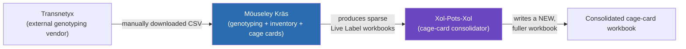
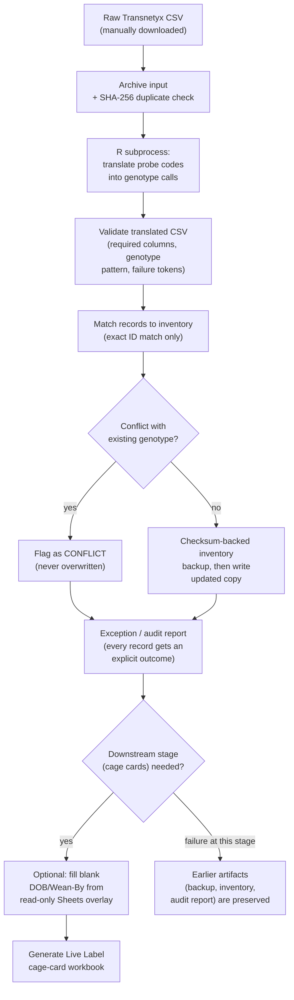
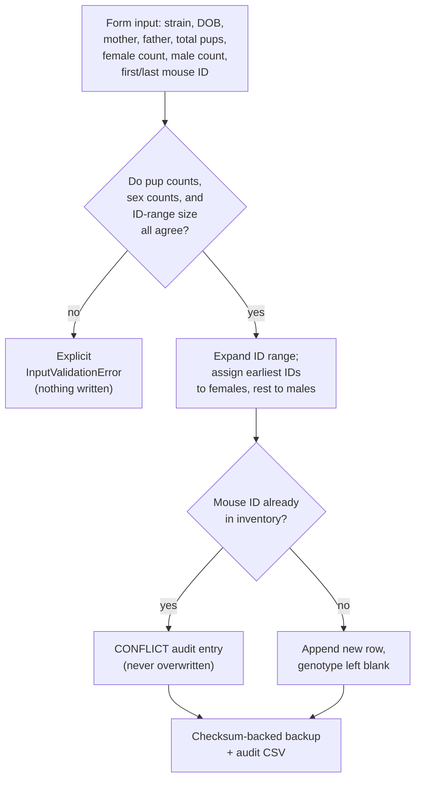
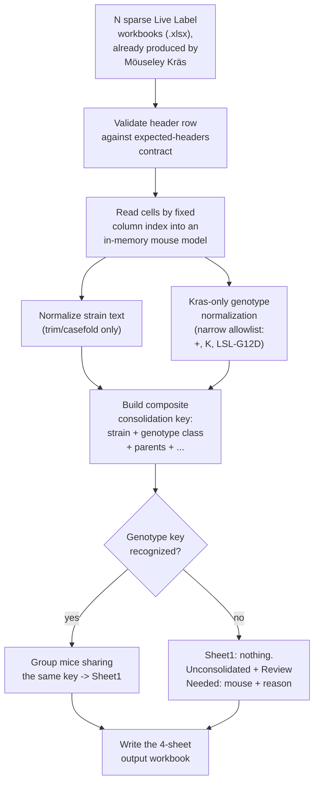

# Möuseley Kräs & Xol-Pots-Xol: System Overview

This document describes two related but independent local tools used in a mouse-genotyping
laboratory workflow, written up for a technical audience (including other coding assistants)
that has no prior context on the codebase.

## System relationship

Möuseley Kräs is the only producer of cage-card workbooks; Xol-Pots-Xol is a pure downstream
consumer. The arrow only goes one way — Xol-Pots-Xol never reads Möuseley Kräs's inventory, raw
Transnetyx files, or source code, and never writes back into Möuseley Kräs's template. They are
two separate codebases (`pyproject.toml`, `src/`, `tests/` each) that happen to operate on the
same kind of Excel artifact at different points in the same lab process.

---

## 1. Möuseley Kräs

### Purpose

Möuseley Kräs turns manually downloaded Transnetyx genotyping-result CSVs into three things:

1. A reconciled copy of the mouse inventory (a master spreadsheet tracking every mouse in the
   colony).
2. An audit/exception report explaining exactly what happened to every record it touched.
3. A "Live Label" weaning-card workbook (physical cage-card labels used in the vivarium).

It also has a second, independent feature for registering brand-new litters into the inventory
before they've been genotyped at all.

The name-brand feature of the system is *safety*: it is explicitly designed to be trustworthy
with irreplaceable, real laboratory records, even though it runs as an ordinary local script/web
app with no database, no server infrastructure, and no dedicated ops team behind it.

### Core CS ideas underpinning the design

**1. Functional core, imperative shell.**
Business logic that decides *what should happen* (e.g. "does this litter's pup/sex/ID-range math
add up?", "does this genotype match an approved pattern?", "which cage-mates can share a card?")
is written as pure functions with no I/O: given the same input, they always return the same
answer, and they don't touch the filesystem, network, or subprocess layer. Orchestration code
(reading files, calling out to R, writing CSVs) is a thin "shell" around that core. This makes
the hard logic unit-testable without ever touching a real file, and makes the I/O boundaries
narrow and auditable.

**2. Configuration as data, not code.**
Which spreadsheet column holds which field, what counts as an "approved" genotype string, which
cells on the Live Label template map to which output field — none of this is hard-coded. It's all
declarative data in one config file (`config/pipeline_run.yaml`), loaded into typed config objects
at startup. This is the same idea behind infrastructure-as-code or schema-driven programs: the
*shape* of the domain (columns, headers, cell coordinates) is treated as configuration the
program consumes, not logic the program encodes, so the lab can re-point the tool at a
differently-shaped spreadsheet without touching source code.

**3. Fuzzy-tolerant *parsing*, zero-tolerance *matching*.**
Column names in real-world spreadsheet exports drift (extra whitespace, punctuation, casing).
Möuseley Kräs is deliberately lenient about *finding* the right column (normalizing punctuation
and case to resolve a header name). But it is deliberately strict about *matching a mouse to a
record*: mouse identity matching is always an exact key match against configured identifier
columns. There is no fuzzy matching of mouse IDs, and no auto-created inventory rows. This
separates two different classes of "uncertainty" in the system — cosmetic uncertainty (is this
column called "DOB" or "D.O.B"?) is absorbed silently; substantive uncertainty (is *this* mouse
the *same* mouse as that inventory row?) is never guessed.

**4. Fail-closed / explicit-outcome auditing.**
Every record that flows through translation and matching is assigned an explicit status from a
closed enum (e.g. READY, CONFLICT, MANUAL_REVIEW, NO_RESULT, PENDING_RERUN) — there is no
"processed successfully, nothing to report" silent path and no default/fallback outcome. This is
the same principle behind exhaustive pattern matching in typed languages: every code path is
accounted for, so an unrecognized situation becomes a visible, categorized exception rather than
being silently absorbed or guessed at. A conflicting genotype is never overwritten; it's
preserved and reported.

**5. Checksum-verified, copy-on-write persistence.**
Before Möuseley Kräs writes anything to the inventory, it computes a cryptographic hash of the
existing file and takes a verified backup copy. Updates are never written in place onto the
source file (except in one narrowly-scoped "append-only" mode used specifically for brand-new
litter rows, which by definition cannot conflict with existing data). This is essentially
copy-on-write applied to a spreadsheet: mutate a copy, verify integrity, then decide whether to
promote it — the same idea that protects data in journaling filesystems and versioned datastores,
scaled down to a single CSV.

**6. Idempotency via content hashing.**
Every raw input file is SHA-256 hashed and checked against a small append-only index before it's
processed. Re-running the exact same Transnetyx export twice is detected and blocked by default
(with an explicit opt-in flag to force a retry). This is the same idea as an idempotency key in a
payment API: the operation is keyed by the content itself, so accidental double-processing is
structurally prevented rather than relying on the operator to remember not to do it.

**7. Process isolation across a language boundary.**
The actual genotype-translation logic — decoding Transnetyx's raw PCR probe codes into
human-readable zygosity calls — is written in R (a language with strong tabular/statistical
libraries), while the orchestration, matching, and web layer are Python. The two talk over a
subprocess boundary with an explicit argument list (never a shell string, which would open a
command-injection vector), and the contract between them is a handful of well-known CSV column
names. This is a small, deliberate polyglot architecture: pick the right tool per layer, and keep
the interface between them as narrow and inspectable as possible (a CSV file and an exit code,
not a shared memory space or an ad hoc RPC protocol).

**8. Separation of concerns via a two-portal interface.**
The system exposes two independent entry points — "Cage Card Production" (the full
translate → match → update inventory → generate cards pipeline) and "Mouse Inventory Update" (a
narrow form for registering new litters pre-genotyping) — both in the CLI and in the web UI. They
share the same underlying inventory-safety primitives (backup, conflict detection, audit
entries) but are otherwise independent code paths that were deliberately kept from blurring into
each other, similar to bounded contexts in domain-driven design: each portal owns one job and one
shape of input, rather than one mega-form trying to do both.

**9. Least-privilege external integration.**
The only place Möuseley Kräs talks to a live, shared, external system (a Google Sheet other lab
members also edit) is a single, narrowly-scoped, opt-in, read-only overlay that fetches exactly
two fields (DOB, Wean-By) and only ever *fills blanks* — it can't overwrite an existing local
value, can't touch genotype, and a fetch failure degrades to a warning rather than aborting the
run. Every cell it actually fills is now logged per mouse ID (not just an aggregate count), so
the overlay's effect on a run is fully auditable after the fact.

### Pipeline flowchart (Cage Card Production)

### Litter-entry flowchart (Mouse Inventory Update portal)

---

## 2. Xol-Pots-Xol

### Purpose

Xol-Pots-Xol is a small, standalone consolidation tool. Möuseley Kräs's Live Label workbooks are
produced one small batch at a time (one cage-card generation run at a time), so over time a lab
ends up with many *sparse* workbooks — each covering a handful of cages. Xol-Pots-Xol reads a set
of those already-produced workbooks and merges compatible entries into fewer, fuller workbooks,
without ever touching Möuseley Kräs's inventory, raw data, or template.

### Core CS ideas underpinning the design

**1. Narrow, explicit coupling to just one piece of domain content.**
Almost everything Xol-Pots-Xol reads (strain names, dam/sire genotype text, most cell values) is
treated as **opaque text** — copied through untouched, only lightly normalized for display
grouping (trim/casefold). The *one* exception is the Kras locus, which the tool needs to
understand semantically in order to decide whether two mice are "the same genotype" for merge
purposes. That single piece of domain knowledge lives in one small, well-named function
(`normalize_kras_genotype`), backed by a named, versioned constant (`KRAS_ALLELE_SHORTHAND` /
`KRAS_GENOTYPE_GRAMMAR_VERSION`) rather than an anonymous inline dict. This is a deliberate
minimal-surface-area design: rather than building a general genotype parser (which would need to
track every locus abbreviation Möuseley Kräs might ever emit), it hard-codes narrow knowledge of
exactly the one thing it needs to decide, and treats everything else as data it doesn't need to
understand. The tradeoff is explicit and by design: change the genotype format upstream in a way
that breaks this one assumption (e.g. reorder loci so Kras isn't listed first), and affected mice
simply fail to consolidate — visibly, not silently, and now named as a specific reason (see below).

**2. Fail-open-to-"don't merge", not fail-open-to-guess.**
When the tool can't confidently classify a genotype, it does not guess a merge group — it puts
that mouse into an explicit "unconsolidated" bucket and reports it, mirroring Möuseley Kräs's own
philosophy of surfacing uncertainty rather than resolving it silently, even though the two
projects don't share code. Every unconsolidated mouse now carries a specific, human-readable
reason (unrecognized sex, blank strain, unsupported Kras genotype, or no usable DOB) rather than
a bare "couldn't merge" flag.

**3. Pure read → transform → write-fresh pipeline.**
The tool never opens a workbook in place and edits it. It reads N sparse workbooks, builds an
in-memory model, computes consolidated groups, and writes one brand-new output workbook from
scratch. This avoids an entire class of bugs around partial in-place spreadsheet mutation (stale
formatting, leftover cells, accidental overwrites) and makes the transformation trivially
re-runnable and side-effect-free on its inputs.

**4. Schema-as-contract via header validation, not fuzzy inference.**
Unlike Möuseley Kräs's lenient column-name resolution, Xol-Pots-Xol reads by fixed column
*index*, but only after validating the header row against an expected-headers contract. This is
a stricter contract than Möuseley Kräs's because Xol-Pots-Xol's own artifacts (workbooks produced
by a single upstream tool it doesn't own) are more uniform than Transnetyx's varied CSV exports,
so a stricter, position-based contract is the appropriate trade-off here — the CS lesson being
that the right rigidity of a parsing contract depends on how much real-world variance the input
actually has, not on applying one matching philosophy everywhere.

**5. Deterministic grouping/consolidation key.**
Mice are grouped for merging by a composite key: normalized strain, plus the Kras-normalized
genotype-equivalence class, plus parents (and other identifying fields). Two differently-worded
genotype strings that mean the same allele state (e.g. `"LSL-G12D/+"` and `"K/+"`) collapse to
one canonical key, so consolidation is really an equivalence-class partitioning problem: define a
canonical key function, then group all records producing the same key.

**6. Result output separates "done" from "needs a human."**
The output workbook always has four sheets, each with one job: `Sheet1` holds only successfully
consolidated cages; `Unconsolidated` preserves every mouse that couldn't be grouped, in its
original cage-row shape, kept structurally separate so it can never be mistaken for a real
consolidated cage; `Review Needed` lists one row per unconsolidated mouse with its source file,
source row, raw genotype text, and specific reason; `Report` records the Kras grammar version,
input/output counts, and a per-input-file hash for reproducibility. This mirrors the same
explicit-outcome philosophy as Möuseley Kräs's audit statuses, expressed as workbook structure
instead of a status enum.

### Flowchart

---

## Summary comparison

| Aspect | Möuseley Kräs | Xol-Pots-Xol |
|---|---|---|
| Role in pipeline | Producer (genotyping → inventory → cage cards) | Consumer (consolidates cage cards) |
| Column matching | Lenient/fuzzy header resolution, strict identity matching | Strict header contract, fixed column index |
| Domain-content coupling | Deep (genotype validation, inventory matching, cell mapping) | Shallow/opaque except one narrow, versioned Kras-specific function |
| Persistence model | Checksum-backed copy-on-write; append-only for new litters | Always writes a brand-new 4-sheet workbook; never mutates inputs |
| External integrations | One explicitly-scoped, opt-in, read-only Sheets overlay (per-mouse audited) | None |
| Uncertainty handling | Explicit per-record audit status enum; conflicts never auto-resolved | Explicit "Unconsolidated"/"Review Needed" sheets with named reasons; no guessed merges |
| Interfaces | CLI + local Flask web app, two portals | CLI + local Flask web app, single command |

---

## 3. Robustness pass (in response to external review)

An external review (via another coding assistant, "codex") proposed a checklist of robustness
improvements after reading only this document, not the code. Auditing each item against the
actual codebase found several were already implemented (run manifests, dry-run mode, atomic
backup writes), and confirmed the rest as genuine gaps. What was actually built:

- **Möuseley Kräs**: regression tests for four branches that existed in code but had no test
  coverage (existing-genotype CONFLICT, unknown-mouse-ID, missing-translated-column, and
  duplicate-inventory-ID), plus a unicode-safety test. The run manifest (`run_summary_<id>.json`)
  now also records the app/Python/R versions, the config file's path and checksum, whether the
  Sheets overlay is enabled, and a SHA-256 of every output artifact. The Sheets overlay now
  reports exactly which mouse IDs and fields it filled, not just a count.
- **Xol-Pots-Xol**: unconsolidated mice no longer blend into the same sheet as real consolidated
  cages (see §2.6 above) — the clearest actual defect the review surfaced. The Kras genotype
  grammar became a named, versioned contract instead of an inline dict duplicated in prose. Eight
  new tests cover previously-untested paths: an unrecognized Kras string flowing end-to-end into
  the unconsolidated bucket, a reordered header row, duplicate mouse IDs, input-file immutability
  across success and failure, and the new four-sheet output structure.

**Deliberately deferred** — each is a real design decision, not a bug fix, so none were done
without an explicit call: an inventory "propose → operator approves → promote" workflow step (the
current one-step-with-backup-and-conflict-detection model stays as-is); new CLI subcommands
(`validate-config`, `inspect-run`, `summarize-audit`); a formal config schema-version field; a
Python/R dependency lock file; and a property-based testing framework (`hypothesis`).

---

## 4. Software versions & device compatibility

Both projects are local, single-user tools, developed and currently only tested on **macOS**.
Neither has been run or verified on Windows or Linux — file-path conventions (e.g. the R
executable path in `config/pipeline_run.yaml`, defaulting to `/usr/local/bin/Rscript`) and the
setup steps below assume a Mac.

### Möuseley Kräs (`automouse`, currently v0.3.1)

| Requirement | Constraint | Verified with |
|---|---|---|
| Python | `>=3.11` (`pyproject.toml`) | 3.14.6 |
| R (external, via subprocess) | Any version with `dplyr` + `purrr` installed | 4.5.2 (system `/usr/local/bin/Rscript`); also verified against 4.5.3 in an isolated conda-forge environment |
| PyYAML | `>=6.0` (core) | — |
| openpyxl, pandas | `>=3.1`, `>=2.2` (`inventory` extra) | 3.1.5 (openpyxl) |
| Flask | `>=3.0` (`webapp` extra) | — |
| google-api-python-client, google-auth | `>=2.100`, `>=2.23` (`sheets` extra, optional — only needed if the Sheets overlay is enabled) | — |

None of these dependencies are pinned to an exact version or locked (see §3's deferred items) —
today's compatibility is "known to work at the versions above," not a guaranteed range.

### Xol-Pots-Xol (`xolpotsxol`, currently v0.1.0)

| Requirement | Constraint | Verified with |
|---|---|---|
| Python | `>=3.11` | 3.14.6 |
| openpyxl | `>=3.1` | 3.1.5 |
| Flask | `>=3.0` | — |

No R dependency at all — it's pure Python plus `openpyxl`.

### Device compatibility

- **Development/test machine**: macOS 26.6.2 (build 25G83), Apple Silicon (arm64).
- Both tools are desktop CLI programs plus an optional local Flask web server — there is no
  mobile or tablet app, and neither can run natively on a phone/tablet.
- The web server binds to `127.0.0.1` (this machine only) by default. It's possible to point it
  at the Mac's LAN address instead (`automouse serve --host <lan-ip>`) so another device on the
  same network — e.g. an iPad — can reach it in a browser, but the Mac still has to be the one
  actually running the server the whole time; there is no standalone or offline mode for a
  second device. See the earlier discussion in this session for the tradeoffs of doing that
  (no built-in authentication, so only do it on a trusted network).
- Apple Silicon vs. Intel Mac: nothing in the codebase is architecture-specific: R and Python are
  both installed system-wide as universal/arch-appropriate builds by their own installers, so an
  Intel Mac should work identically, but this has not been separately verified in this session.
